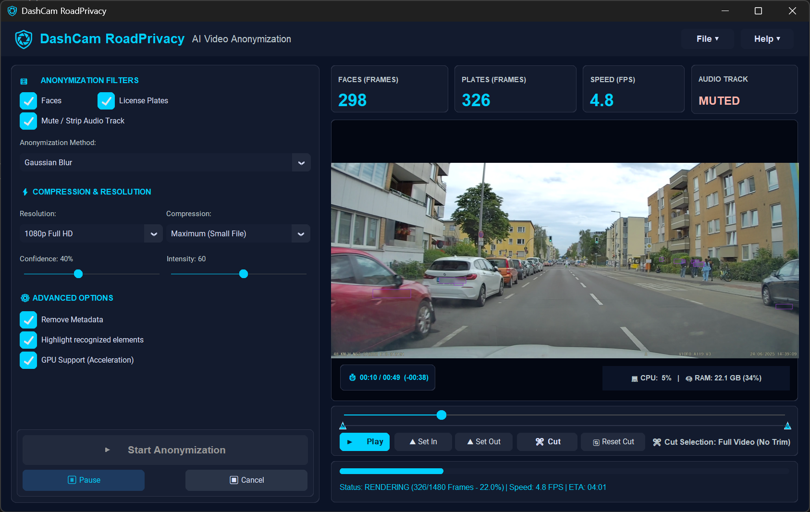

# DashCam RoadPrivacy

[](https://github.com/engstaNET/DashCam_RoadPrivacy/releases)
[](https://github.com/engstaNET/DashCam_RoadPrivacy)
[](LICENSE)
[](PRIVACY.md)

**DashCam RoadPrivacy** is a high-performance, standalone Windows application engineered for automated AI-powered video anonymization. Designed specifically for DashCam footage, action camera recordings, and public video captures, it automatically detects and redacts faces and vehicle license plates while offering GPU DirectML hardware acceleration and customizable compression.



---

## 🌟 Key Features

- **⚡ Dual AI Engine Detection:**
  - **Faces:** Ultra-fast OpenCV YuNet DNN Face Detector tuned for distant and small faces.
  - **License Plates:** Multi-stage YOLOv8 ONNX Runtime detector combined with Haar Cascade verification for automotive license plates.
- **🚀 GPU Hardware Acceleration:** DirectML & ONNX Runtime support for NVIDIA, AMD, and Intel GPUs, plus multi-threaded CPU fallback.
- **🔒 100% Local & Private:** Runs entirely offline on your PC. No internet connection required, zero cloud uploads, and zero telemetry.
- **✂️ Frame-Accurate Video Trimming:** Built-in timeline slider with `Set In` / `Set Out` points for non-destructive cutting.
- **🎛️ Anonymization Customization:**
  - **Redaction Modes:** Gaussian Blur, Pixelation, Blackout.
  - **Adjustable Controls:** Dynamic confidence thresholding and blur intensity sliders.
- **🛡️ Metadata Stripping & Audio Control:** Strip EXIF/location metadata and optionally mute or remove audio tracks.
- **🎬 Branded Outro Sequence:** Appends a clean 2-second branded closing screen with centered logo at video resolution.
- **📦 Portable Standalone Executable:** No Python installation or external dependencies required. Simply download and run.

---

## 📥 Download & Installation

### Latest Release: **v1.0.0**

1. Go to the [Releases](https://github.com/engstaNET/DashCam_RoadPrivacy/releases) page.
2. Download `DashCam_RoadPrivacy_v1.0.0_win64.zip`.
3. Extract the ZIP archive to any directory on your PC.
4. Launch `RoadPrivacy_v1.0.0.exe`.

> **Note for Windows Defender / SmartScreen:**  
> Since the executable is freshly built and self-signed, Windows Defender SmartScreen may show an informational warning. Click **More info** -> **Run anyway**.

---

## 🔐 Security & SHA-256 Verification

To ensure that your download has not been tampered with, you can verify the SHA-256 hash against the official values below:

| File Name | Target Platform | SHA-256 Hash |
| :--- | :--- | :--- |
| **`DashCam_RoadPrivacy_v1.0.0_win64.zip`** | Windows 10/11 x64 | `e165886ba53cfc50e3cccfad9a3026514e6f351b982a4df3a74160be70667628` |
| **`RoadPrivacy_v1.0.0.exe`** | Windows 10/11 x64 | `51a1463e4ee18d74a259c2ac9c67db88a1e3f4f15a9645b54fb89aeb45911f2a` |

### Verifying Hashes in Windows PowerShell:

```powershell
Get-FileHash -Algorithm SHA256 .\DashCam_RoadPrivacy_v1.0.0_win64.zip
```

---

## 🖥️ System Requirements

- **Operating System:** Windows 10 or Windows 11 (64-bit)
- **Processor:** Dual-Core x86-64 CPU (Quad-Core recommended)
- **Memory:** 4 GB RAM (8 GB recommended)
- **Graphics (Optional):** DirectX 12 compatible GPU for DirectML hardware acceleration

---

## 📄 License & Attribution

This project is licensed under the [MIT License](LICENSE).  
For third-party components and AI model licenses, see [THIRD_PARTY_LICENSES.md](THIRD_PARTY_LICENSES.md).

Developed by **Artur F.** ([engstaNET](https://github.com/engstaNET)).
